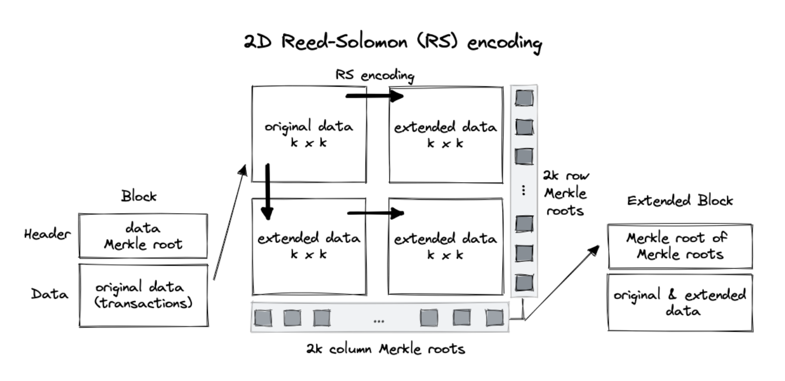

  <h1>rsmt2d-rs</h1>
   
  <a href="https://github.com/stark-rocket/rsmt2d-rs/issues/new?assignees=&labels=bug&template=01_BUG_REPORT.md&title=bug%3A+">Report a Bug</a>
  -
  <a href="https://github.com/stark-rocket/rsmt2d-rs/issues/new?assignees=&labels=enhancement&template=02_FEATURE_REQUEST.md&title=feat%3A+">Request a Feature</a>
  -
  <a href="https://github.com/stark-rocket/rsmt2d-rs/discussions">Ask a Question</a>

 

Table of Contents

- [Report a Bug](#report-a-bug)
- [Request a Feature](#request-a-feature)
- [About](#about)
- [Getting Started](#getting-started)
  - [Prerequisites](#prerequisites)
  - [Installation](#installation)
- [Usage](#usage)
- [Roadmap](#roadmap)
- [Support](#support)
- [Project assistance](#project-assistance)
- [Contributing](#contributing)
- [Authors \& contributors](#authors--contributors)
- [Security](#security)
- [License](#license)
- [Acknowledgements](#acknowledgements)

---

## About

Rust implementation of two dimensional Reed-Solomon merkle tree data availability scheme.

This technique is used by Celestia for their data availability sampling solution.

The scheme is described in the [Fraud and Data Availability Proofs: Maximising Light Client Security and Scaling Blockchains with Dishonest Majorities](https://arxiv.org/pdf/1809.09044.pdf).

The implementation is inspired by the [rsmt go implementation](https://github.com/celestiaorg/rsmt2d).

The 2D Reed-Solomon Merkle-Tree data architecture looks like this:

## Getting Started

### Prerequisites

- [Rust](https://www.rust-lang.org/tools/install)

### Installation

> **[TODO]**

## Usage

## Roadmap

See the [open issues](https://github.com/stark-rocket/rsmt2d-rs/issues) for a list of proposed features (and known issues).

- [Top Feature Requests](https://github.com/stark-rocket/rsmt2d-rs/issues?q=label%3Aenhancement+is%3Aopen+sort%3Areactions-%2B1-desc) (Add your votes using the 👍 reaction)
- [Top Bugs](https://github.com/stark-rocket/rsmt2d-rs/issues?q=is%3Aissue+is%3Aopen+label%3Abug+sort%3Areactions-%2B1-desc) (Add your votes using the 👍 reaction)
- [Newest Bugs](https://github.com/stark-rocket/rsmt2d-rs/issues?q=is%3Aopen+is%3Aissue+label%3Abug)

## Support

Reach out to the maintainer at one of the following places:

- [GitHub Discussions](https://github.com/stark-rocket/rsmt2d-rs/discussions)
- Contact options listed on [this GitHub profile](https://github.com/stark-rocket)

## Project assistance

If you want to say **thank you** or/and support active development of rsmt2d-rs:

- Add a [GitHub Star](https://github.com/stark-rocket/rsmt2d-rs) to the project.
- Tweet about the rsmt2d-rs.
- Write interesting articles about the project on [Dev.to](https://dev.to/), [Medium](https://medium.com/) or your personal blog.

Together, we can make rsmt2d-rs **better**!

## Contributing

First off, thanks for taking the time to contribute! Contributions are what make the open-source community such an amazing place to learn, inspire, and create. Any contributions you make will benefit everybody else and are **greatly appreciated**.

Please read [our contribution guidelines](docs/CONTRIBUTING.md), and thank you for being involved!

## Authors & contributors

For a full list of all authors and contributors, see [the contributors page](https://github.com/stark-rocket/rsmt2d-rs/contributors).

## Security

rsmt2d-rs follows good practices of security, but 100% security cannot be assured.
rsmt2d-rs is provided **"as is"** without any **warranty**. Use at your own risk.

_For more information and to report security issues, please refer to our [security documentation](docs/SECURITY.md)._

## License

This project is licensed under the **MIT license**.

See [LICENSE](LICENSE) for more information.

## Acknowledgements

- Huge props to Celestia of course for the original implementation in [Go](https://github.com/celestiaorg/rsmt2d) and the [paper](https://arxiv.org/pdf/1809.09044.pdf).
